# AIHealthCheck (ARTI-409-A) Roadmap

Below is the high-level roadmap and architectural ownership for the AIHealthCheck project. 

The frontend redesign phase is completely finished. The focus now shifts toward backend integration and wiring the UI up to the FastAPI services.

```mermaid
graph TD
    %% Core Nodes
    A[<b>AIHealthCheck</b><br>Core Platform]:::core
    
    %% Modules
    M1[<b>Module 1: Service Registry</b><br>Owner: Jack]:::mod1
    M2[<b>Module 2: Monitoring & Evals</b><br>Owner: Sakir]:::mod2
    M3[<b>Module 3: Incident Triage</b><br>Owner: Osele]:::mod3
    M4[<b>Module 4: Governance</b><br>Owner: Jeewanjot]:::mod4

    A --- M1
    A --- M2
    A --- M3
    A --- M4

    %% Sub-tasks M1
    M1 --- M1A[Services UI Redesign<br><i>Completed</i>]
    M1 --- M1B[Registry CRUD API<br><i>Pending</i>]
    M1 --- M1C[Test Connection Logic<br><i>Pending</i>]

    %% Sub-tasks M2
    M2 --- M2A[Dashboard UI Redesign<br><i>Completed</i>]
    M2 --- M2B[Metrics Telemetry API<br><i>Pending</i>]
    M2 --- M2C[Concept Drift Engine<br><i>Pending</i>]

    %% Sub-tasks M3
    M3 --- M3A[Triage Workspace UI<br><i>Completed</i>]
    M3 --- M3B[LLM Draft Generation API<br><i>Pending</i>]
    M3 --- M3C[Maintenance DB Pipeline<br><i>Pending</i>]

    %% Sub-tasks M4
    M4 --- M4A[Admin & Auth UI<br><i>Completed</i>]
    M4 --- M4B[RBAC Middleware<br><i>Pending</i>]
    M4 --- M4C[Audit & Compliance DB<br><i>Pending</i>]

    classDef core fill:#0B1120,stroke:#3B82F6,stroke-width:2px,color:#fff,rx:8px,ry:8px
    classDef mod1 fill:#EFF6FF,stroke:#3B82F6,stroke-width:1px,color:#1E3A8A,rx:4px,ry:4px
    classDef mod2 fill:#ECFDF5,stroke:#10B981,stroke-width:1px,color:#064E3B,rx:4px,ry:4px
    classDef mod3 fill:#FFF7ED,stroke:#F97316,stroke-width:1px,color:#7C2D12,rx:4px,ry:4px
    classDef mod4 fill:#F5F3FF,stroke:#8B5CF6,stroke-width:1px,color:#4C1D95,rx:4px,ry:4px
```

## Phase Breakdown

1. **Phase 1: Foundation (Completed)**
   - Database schema setup (SQLite + Alembic)
   - FastAPI core scaffolding
   - React boilerplate initialization

2. **Phase 2: Premium UI Redesign (Completed)**
   - Unified dark navy/slate dashboard layout
   - Extensive mock data mapping for all modules
   - Recharts integration & responsive grids

3. **Phase 3: Backend API Wiring (Current)**
   - Connect the Python FastAPI routes (`routers/`) to the React Axios calls (`utils/api.js`)
   - Establish the LLM Wrapper connection in `llm_client.py`
   - Real-time telemetry and database tracking

4. **Phase 4: QA & Finalization (Upcoming)**
   - End-to-end (E2E) feature verification
   - Security auditing & Role verification
   - Final academic project submission
